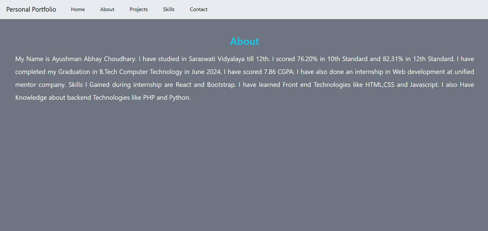
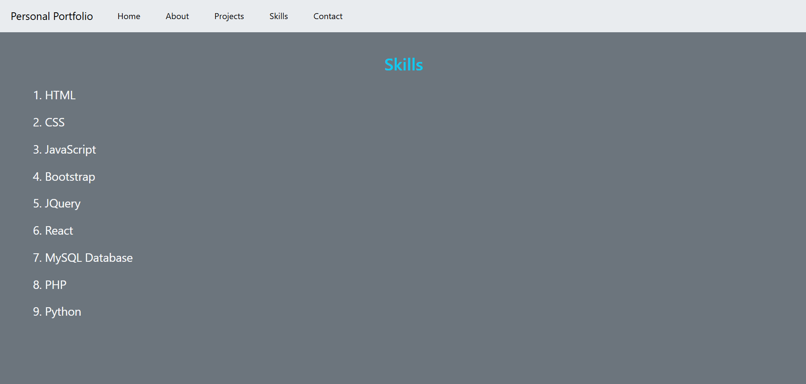
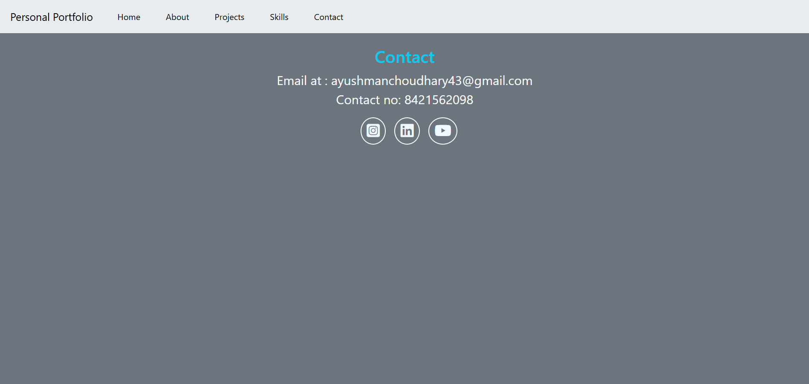

This is My portfolio App that I created using HTML, CSS , Bootstrap and React. This app includes Routing to other pages By clicking on links in the Navbar.  

There are five Main Structure of this portfolio:
<ol>
<li>Home page
<li>About
<li>Projects
<li>Skills
<li>Contact page
</ol>

Every other page can be accessed by each pages. 

Home page of this site looks like this: 

About page of this site looks like this: 

Project page of this site looks like this: 
 
 
 

Skills page of this site looks like this: 

Contact page of this site looks like this: 

All of these pages are Responsive so it can work properly on any devices such as Mobiles,tablets,Laptops or even PCs.